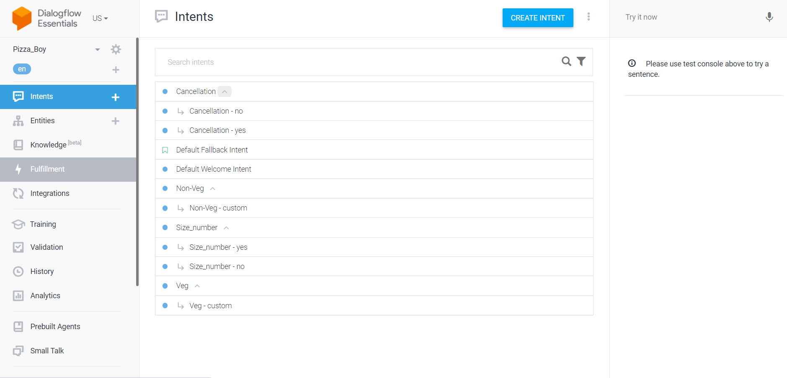
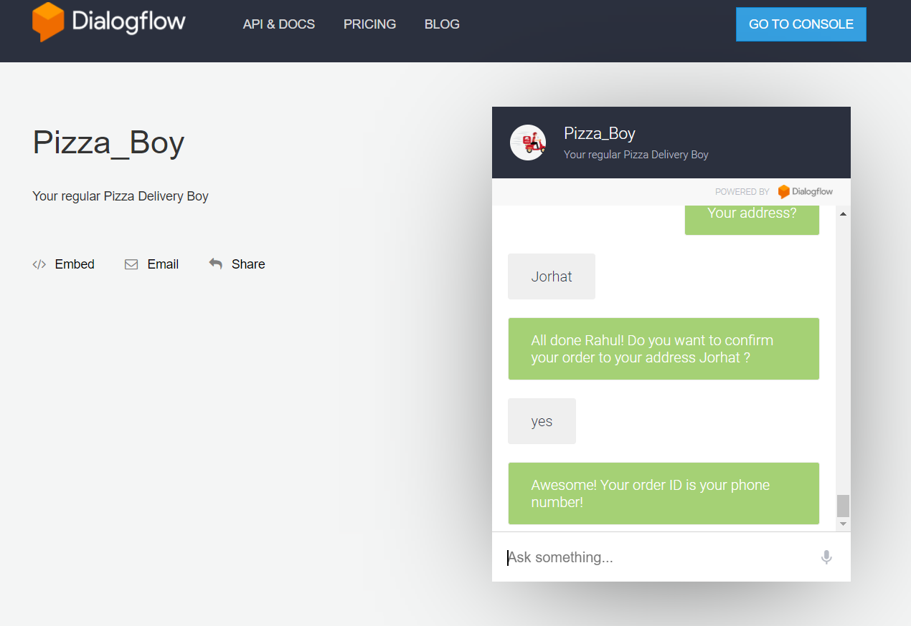
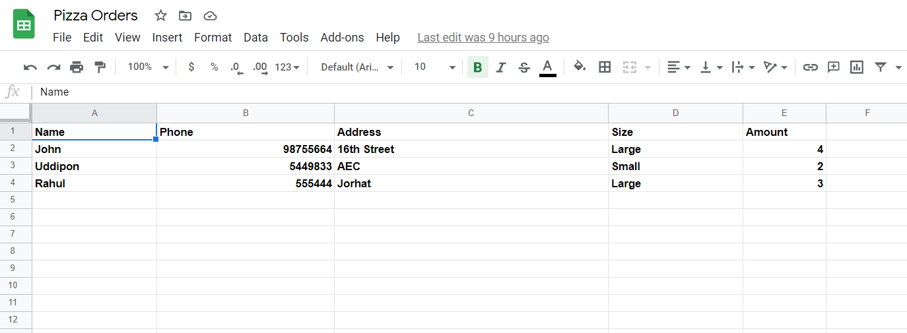

# Pizza-Ordering-Chatbot
A simple Pizza Ordering Chatbot using Dialogflow, that talks with the user, takes their details and store them in a REST API Google Spreadsheet.

# Dialogflow

# Dialogflow Console
This is the console on which user can interact with the bot.

# Google Spreadsheet
The user's data is saved in the Google Spreadsheet real-time. A third-party server called "sheetdb.io' is used to make the spreadsheet a REST API. NPM Axios is used as an HTTP client for the web browser and node.js

